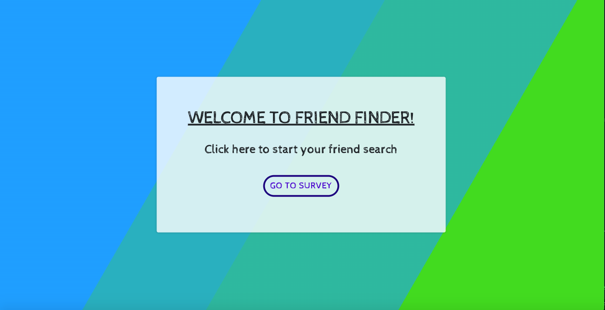

# Friend_Finder

## Overview
Welcome to Friend_Finder! Friend_Finder is a full-stack site that takes in results from users' surveys, scoring, storing, and comparing their answers with those from other users. Hosted on Heroku, users can route to the homepage, survey page, and API Friends List page. By calculating the absolute difference of each user, Friend_Finder will display the name and picture of the user with the best overall friendship match!

Curious to find your future friend? Check it out at: [Friend Finder](https://friend-finder-adi868.herokuapp.com/)!

### Instructions:
1. To start, type in your name (Full Name) and link to a photo of you (so your future friends can identify you!).
2. The survey will have 10 questions. Answer each question on how much you agree with each statement on a scale of 1 to 5 (Strongly Agree to Strongly Disagree).
3. Submit your answers for the sorting algorithm to calculate your ultimate friendship match.

### Installation:
1. Clone the complete repository from Github.
2. Run `npm install` in the terminal. This will install the required dependencies in the `package.json`. When that's done, you can start the application in the terminal with `node server.js` (from the root). Navigate to the localhost port on your browser to open the application.

### Technologies:
* JavaScript
* Node.js
* HTML5
* CSS
* Animate.css
* Express
* Path
* Heroku
* Bootstrap
* NPM Packages
 
#### Application Organization:
The overall organization of the directory is as follows:
```
 Friend_Finder
    - .gitignore
    - app
      - data
        - friends.js
      - public
        - home.html
        - survey.html
      - routing
        - apiRoutes.js
        - htmlRoutes.js
    - node_modules
    - package.json
    - server.js
 ```
    
By routing to `API Friends List`, users can see all the current stored users in the Friend Finder API.

#### Screenshot:



#### Deployed Link: 
[Friend Finder](https://friend-finder-adi868.herokuapp.com/)

---
© 2019 Adina Cianciotto adi868
